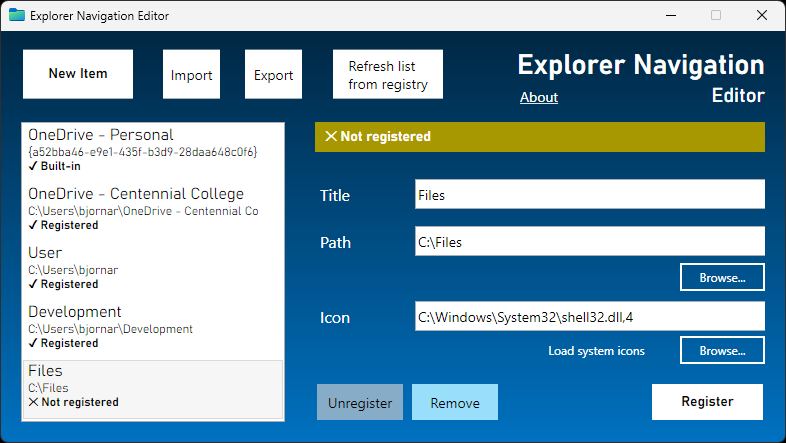

# Explorer Navigation Editor

Version: 1.0.0

Author: Bjornar Egede-Nissen (C)

License: MIT

Created in C# (.NET 7.0)

---

Edit items in the Windows Explorer navigation bar (sidebar). These items can be expanded like normal folders, unlike shortcuts in the Quick Access section.

## How it works

Navigation items are defined in the Registry. They can be added or removed manually with .reg files:

* [C-Files_enable.reg](C-Files_enable.reg)
* [C-Files_disable.reg](C-Files_disable.reg)

## To do

* Export to JSON
* Import from JSON
* Item position
